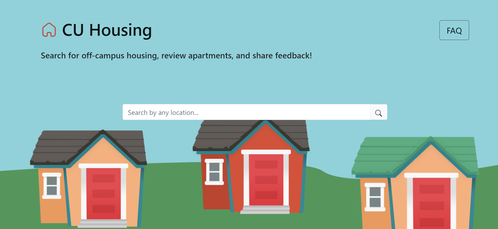

# CU Apartments

[CUApts Production Site (Official)](https://www.cuapts.org/)
[CUApts Staging Site (Developer's Update)](https://cuapts-staging.herokuapp.com/)

_Last updated 11/20/2023_

## About

Helping the Cornell community at-large find reviews and information about housing and landlords.

## Getting Started

You will need Node.js and Yarn installed on your development machine. This project requires `node 18` to run locally. 

To setup your environment, go into the root folder and run `yarn install`. This installs the necessary
dependencies in each required Yarn workspace. Then, run `yarn start` to start a development server
for frontend and backend in parallel. If you specifically want to run either the frontend or backend
on its own, run `yarn frontend-dev` or `yarn backend-dev`.

## Contributors

You can find a running list of all contributors [here](https://github.com/cornell-dti/cu-apts/blob/main/CONTRIBUTORS.md).  

We are a team within the Cornell Design & Tech Initiative. For more information, see
[our website](https://cornelldti.org).

