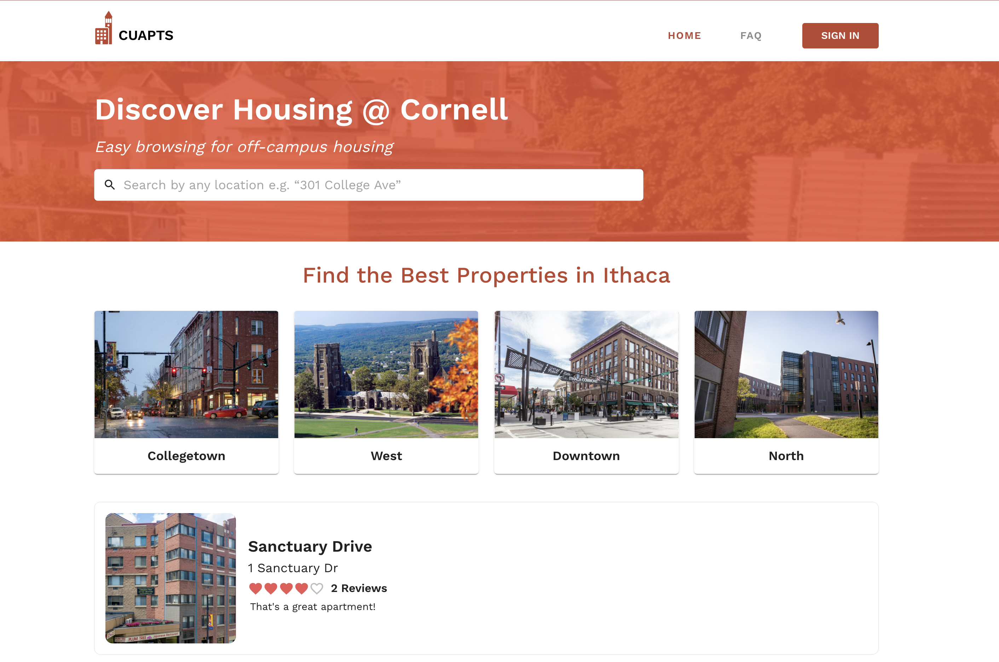

# CU Apartments

[Staging Site (currently no backend support)](https://cu-apts-staging.web.app/)

_Last updated 12/17/2021_

## About

Helping the Cornell community at-large find reviews and information about housing and landlords.

## Getting Started

You will need Node.js and Yarn installed on your development machine.

To setup your environment, go into the root folder and run `yarn`. This installs the necessary
dependencies in each required Yarn workspace. Then, run `yarn start` to start a development server
for frontend and backend in parallel. If you specifically want to run either the frontend or backend
on its own, run `yarn workspace frontend start` or `yarn workspace backend start`.

## Contributors

### 2022-2023

- **Francis Bahk** - Product Manager
- **Sarah Young** - Product Manager
- **Thuy (Sophia) Pham** - Technical Product Manager
- **Maywa Padungrat** - Designer
- **Cyrus Irani** - Developer
- **Daniel Jin** - Developer
- **Ankit Lakkapragada** - Developer

### 2021-2022

- **Huey Le** - Product Manager
- **Alex Kim** - Product Marketing Manager
- **Sam Liu** - Technical Product Manager
- **Heewon Ahn** - Developer
- **Kinjal Jasani** - Developer
- **Mena Attia** - Developer
- **Thuy (Sophia) Pham** - Developer
- **Cyrus Irani** - Developer
- **Jiayuan Gu** - Developer

### 2020-2021

- **Bahar Tehranipoor** - Product Manager
- **Ashrita Raman** - Technical Product Manager
- **Peter Wu** - Technical Product Manager
- **Buma Gana** - Designer
- **Stacy Wei** - Designer
- **Enoch Chen** - Developer
- **Kinjal Jasani** - Developer
- **Mena Attia** - Developer
- **Sam Liu** - Developer

We are a team within the Cornell Design & Tech Initiative. For more information, see
[our website](https://cornelldti.org).

